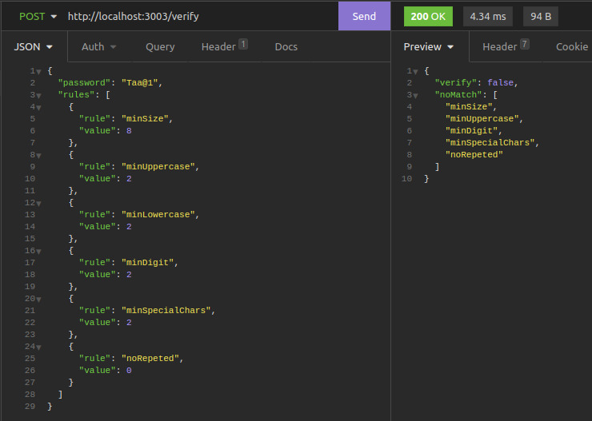
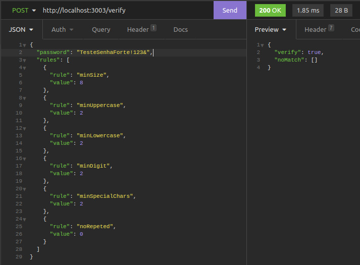
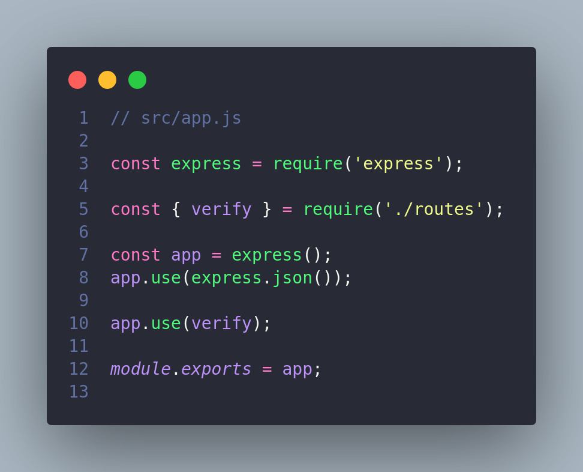
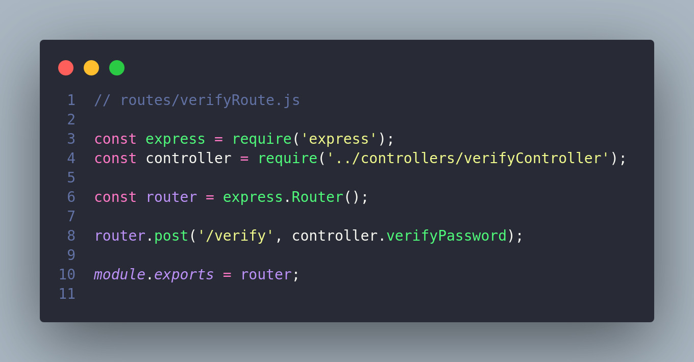
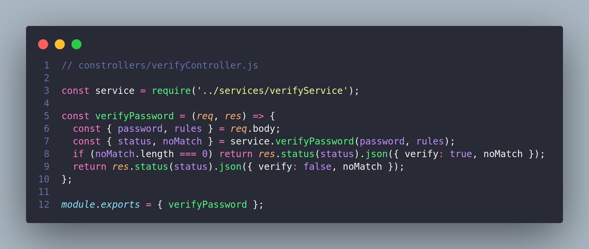
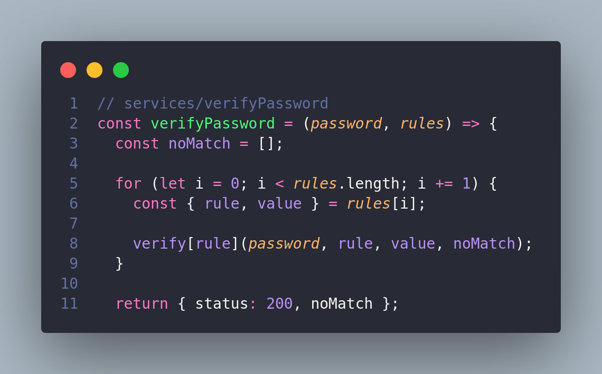
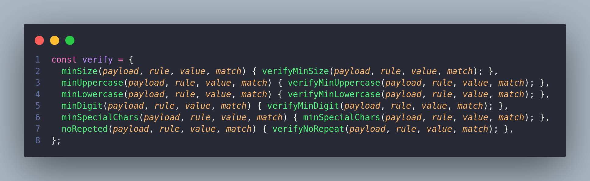
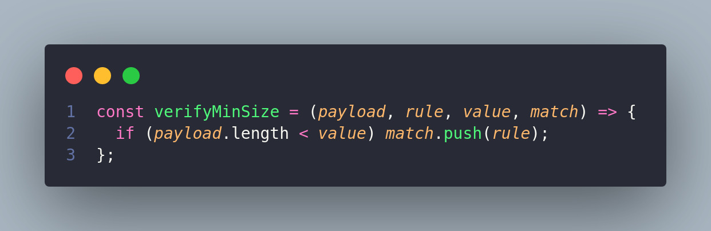

# Resultado 

As imagens abaixo são da tela do client (Insomnia). A primeira imagem mostra o retorno da requisição quando a senha (password), não passa em nenhuma das situações possíveis de teste, portanto uma senha inválida. A segunda imagem exibe o oposto, quando a senha obedece todos os critérios possíveis, sendo assim uma senha válida.
É possível fazer requisições com todos esses casos ou com as situações que desejar dentre essas opções. A aplicação foi estruturada com essa flexibilidade.





# Tecnologias & Ferramentas
  ## Contexto

  Para estruturar a aplicação utilizei inicialmente as melhores tecnologias, cérebro, papel e caneta. Estas fazem parte do meu dia-a-dia para fazer rascunhos das minhas ideias. Ao avançar utilizei o **trello** com intuito de organizar algumas tarefas prioritária e para ter maior controle do fluxo de desenvolvimento. Para codificar a aplicação utilizei o **Visual Studio Code** “para os íntimos VsCode”. O client Insomnia para testar a rota e visualizar o retorno das requisições. As tecnologias foram **NodeJs e ExpressJs**, estas fundamentais para a aplicação desenvolvida. Escolhi essas, pois estou habituado e me sinto mais confiante ao desenvolver com elas, embora nunca descarto me aventurar em outras tecnologias, para mim não existe bala de prata, meu foco é resolver o problema. Utilizei também para ambiente de desenvolvimento o Eslinter que me auxilia em manter um código padronizado e legível e o Nodemon para manter o back-end rodando enquanto desenvolvo. Dentro das limitações do meu conhecimento, foquei em manter o desenvolvimento mais próximo da arquitetura **REST**, utilizando assim o protocolo **HTTP** de forma mais eficiente. Por fim, utilizei a arquitetura **MSC** (Model Service Controller), está permite ganho de qualidade e de facilidade de manutenção, pois o código é organizado agrupando as partes que possuem responsabilidades similares em um mesmo lugar.


---


&nbsp;

### Back-end:
> Desenvolvido usando: NodeJS, ExpressJS, ES6

### Feramentas:
> Desenvolvido usando: Visial Studio Code, Nodemon, Trello

### Testes Integração:
> Desenvolvido usando: Mocha, Chai e Sinon

&nbsp;

# Entendendo Melhor a Aplicação

A proposta foi desenvolver um sistema para verificar a força de uma senha como parte de um sistema maior o qual pode ter vários níveis de acesso diferentes. A API a ser desenvolvida precisaria trabalhar com vários conjuntos de regras fornecidas, sendo assim, a API receberia uma requisição *REST* no formato *JSON* através da rota _**/verify**_ contendo a senha e uma lista de regras. Devendo retorna o resultado no formato JSON.
Então foquei primeiro em estruturar a aplicação desenvolvendo a rota e testar inicialmente para verificar se está funcionando como esperado. Conectando o fluxo app as camadas controller e service. É uma prática que costumo aplicar sempre que estou iniciando a construção de uma aplicação.



Resolvi criar um diretório (routes) para as rotas, visando uma maior organização das rotas, caso surja a necessidade de novas rotas. A imagem abaixo mostra a implementação da rota _**/verify**_. Será utilizado o método HTTP POST, pois será preciso enviar as informações (senha e regras) para validar a força da senha.  A partir daí é acessado o método *verifyPassword* na camada *CONTROLLER*, responsável por validar se a requisição possui a informações necessárias para a camada *SERVICE*.



A imagem a baixo mostra o exemplo possível dos dados enviado via método POST.Importante para entender as informações que o *controller* está esperando.


No *controller* foi feito a desestruturação das propriedades *password* e *rules* do corpo da requisição, conforme mostra a imagem abaixo na **linha 4**. Na **linha 5**, as propriedades desestruturadas são passadas como parâmetro para o método *verifyPassword* na camada de *service* e, em simultâneo, desestruturo o retorno desse método (no service entenderemos melhor as propriedades *status* e *noMatch* desestruturadas). A **linha 6** espera que o retorno do noMatch seja zero, indicando que a senha está dentro das regras estabelecidas nos dados enviados na requisição, retornando o status *HTTP 200* com o retorno em JSON. Caso a senha não passe na verificação, a linha 6 dita o que sera retornado ao client.



Por fim e não menos importante, o **SERVICE.** Esta camada se restringe às **REGRAS DE NEGÓCIO** da aplicação, ou seja, todos os procedimentos e regras que geram valor. Com o intuito de desacoplar a regra de negócio das outras camadas ou de qualquer tecnologia e consequentemente  facilitando a manutenção do código. Conforme a imagem a abaixo, a função **verifyPassword** recebe os dados da camada **controller** através dos parâmeros **password** e **rules.**

Como uma das informações é uma lista de regras e valores, com algumas possibilidades conhecidas, a ideia aqui é mapear as propriedades através do laço de repetição for, na linha 50 no código. De cada iteração é extraída as propriedades (rule e value), dessa maneira é possível associar cada valor de rule a uma função do objeto de funções *verify*  através do *“object literals”*, na **linha 38** no código.




A partir daí, cada rule é associada a uma função do objeto *verify*. Cada método invoca uma função *callback* responsável por aplicar a regra de negócio na senha. Vou explicar uma função, a partir daí a mesma lógica foi aplicada as outras funções. A função minSize, recebe como parâmetros a senha no parâmetro *payload*, uma regra (nesse caso ‘minSize’), o *value* associado a regra, e um array match. Invoca a callback *verifyMinSize* passando os mesmo parâmetros. Essa *callback* é responsável por verificar se a senha possui o tamanho especificado na regra, se não houver, através do método *push()*, adiciona a rule *‘minSize’* ao array mach. Segue a implementação da função verifyMinSize na imagem abaixo.



&nbsp;


## Instalando Dependências

> Backend
```bash
cd STUDIO_SOL/ 
npm install
``` 

## Executando aplicação

* Para rodar o back-end:

  ```
  cd STUDIO_SOL/ && npm start
  ```

## Executando Testes

* Para rodar todos os testes:

  ```
    npm test

  ```
